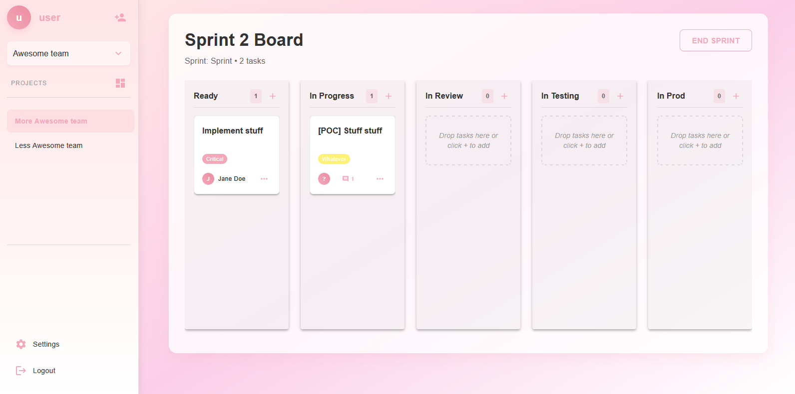
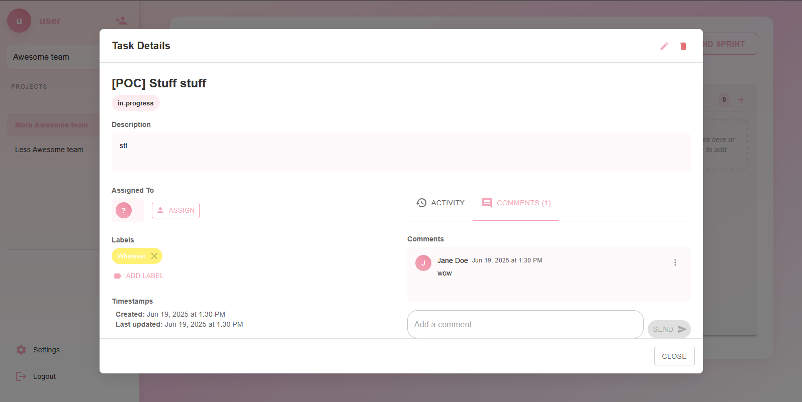

# 🏆 Schrum - Agile Project Management Tool

**Schrum** is a powerful and intuitive project management application built specifically for Scrum teams. It helps teams streamline sprint planning, track progress, and collaborate efficiently. 🚀

---

## ✨ Features

- 📌 **Backlog & Sprint Management**  
  Organize tasks, prioritize user stories, and plan sprints effortlessly.

- 📊 **Kanban Board**  
  Visualize workflow and track progress in real-time with an interactive board.

- 🎯 **User-Friendly Interface**  
  A clean, modern UI designed for productivity and ease of use.

---

## 📚 Documentation & Diagrams

To better understand the architecture and flow of the application, the following diagrams are available in the `assets/` folder:

### 📄 UML & System Design

- [📘 Use Case Diagram](assets/useCaseDiagram.pdf)
- [🏗️ Class Diagram](assets/classDiagram.pdf)
- [🔄 State Diagram](assets/stateDiagram.pdf)

---

## 🖼️ UI Screenshots

Here are a few snapshots of Schrum in action:

  
_Main dashboard with sprint overview and active tasks._

  
_Kanban board showing task dialog._

---

## 📽️ Sequence Diagrams

Available in the `assets/sequence/` directory:

- [🧩 Sequence Diagram 1](assets/sequence/sequenceDiagram1.PNG)
- [🧩 Sequence Diagram 2](assets/sequence/sequenceDiagram2.PNG)
- [🧩 Sequence Diagram 3](assets/sequence/sequenceDiagram3.PNG)
- [🧩 Sequence Diagram 4](assets/sequence/sequenceDiagram4.PNG)
- [🧩 Sequence Diagram 5](assets/sequence/sequenceDiagram5.PNG)

---

## � Getting Started

### Prerequisites

Before you begin, ensure you have the following installed:

- **Node.js** (v16 or higher)
- **npm** or **yarn** package manager
- **Git**

### Installation & Setup

#### 1️⃣ Clone the Repository

```bash
git clone https://github.com/yourusername/Schrum-Project-Management-Tool.git
cd Schrum-Project-Management-Tool
```

#### 2️⃣ Install Backend Dependencies

```bash
cd api
npm install
```

#### 3️⃣ Install Frontend Dependencies

```bash
cd ../client
npm install
```

#### 4️⃣ Start the Backend Server

From the `api/` directory:

```bash
npm run start:dev
```

The backend will run on **http://localhost:3000**

#### 5️⃣ Start the Frontend Server

From the `client/` directory (in a new terminal):

```bash
npm run dev
```

The frontend will run on **http://localhost:5173** (or another available port)

#### 6️⃣ Access the Application

Open your browser and navigate to:

```
http://localhost:5173
```

You should now see the Schrum application! 🎉

### Environment Configuration (Optional)

If you need to configure environment variables:

**Backend** (`api/.env`):

```
DATABASE_URL=./db.db
JWT_SECRET=your_secret_key
NODE_ENV=development
```

**Frontend** (`client/.env`):

```
VITE_API_URL=http://localhost:3000
```

---

## �🛠️ Tech Stack

- Frontend: React.js
- Backend: NestJS
- Database: SQLite
- Auth: JWT
